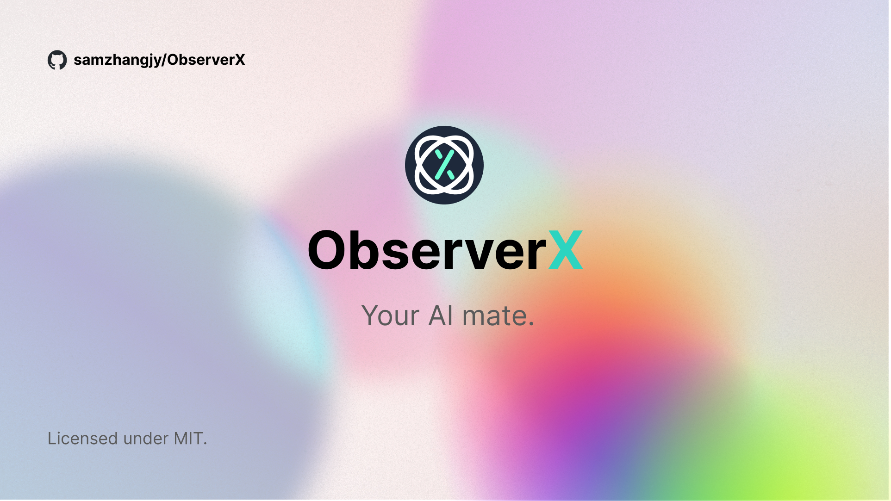
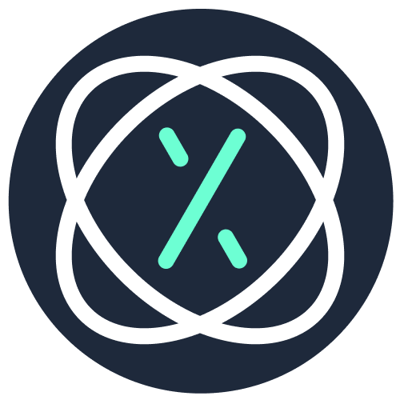

<!-- Improved compatibility of back to top link: See: https://github.com/othneildrew/Best-README-Template/pull/73 -->
<a name="readme-top"></a>
<!--
*** Thanks for checking out the Best-README-Template. If you have a suggestion
*** that would make this better, please fork the repo and create a pull request
*** or simply open an issue with the tag "enhancement".
*** Don't forget to give the project a star!
*** Thanks again! Now go create something AMAZING! :D
-->



<!-- PROJECT SHIELDS -->
<!--
*** I'm using markdown "reference style" links for readability.
*** Reference links are enclosed in brackets [ ] instead of parentheses ( ).
*** See the bottom of this document for the declaration of the reference variables
*** for contributors-url, forks-url, etc. This is an optional, concise syntax you may use.
*** https://www.markdownguide.org/basic-syntax/#reference-style-links
-->
[![Contributors][contributors-shield]][contributors-url]
[![Forks][forks-shield]][forks-url]
[![Stargazers][stars-shield]][stars-url]
[![Issues][issues-shield]][issues-url]
[![MIT License][license-shield]][license-url]


<!-- PROJECT LOGO -->
<br />
<div align="center">
  <a href="https://github.com/samzhangjy/ObserverX">
    
  </a>

<h3 align="center">ObserverX</h3>

  <p align="center">
    Your AI mate.
    <br />
    <a href="https://observerx.samzhangjy.com/"><strong>Explore the docs »</strong></a>
    <br />
    <br />
    <a href="https://github.com/samzhangjy/ObserverX">View Demo</a>
    ·
    <a href="https://github.com/samzhangjy/ObserverX/issues">Report Bug</a>
    ·
    <a href="https://github.com/samzhangjy/ObserverX/issues">Request Feature</a>
  </p>
</div>


<!-- TABLE OF CONTENTS -->
<details>
  <summary>Table of Contents</summary>
  <ol>
    <li>
      <a href="#about-the-project">About The Project</a>
    </li>
    <li>
      <a href="#getting-started">Getting Started</a>
      <ul>
        <li><a href="#prerequisites">Prerequisites</a></li>
        <li><a href="#installation">Installation</a></li>
      </ul>
    </li>
    <li><a href="#roadmap">Roadmap</a></li>
    <li><a href="#contributing">Contributing</a></li>
    <li><a href="#license">License</a></li>
  </ol>
</details>


<!-- ABOUT THE PROJECT -->
## About The Project

ObserverX is a bot framework bundled with various builtin features, including:

- Dynamic database loading
- Instant history search for bot
- Ready-to-deploy admin panel
- Multiple deployable platforms
- Fully customizable

ObserverX is currently built on top of GPT-3.5 / GPT-4's `function` API and may support other
bots in the future.

<!-- GETTING STARTED -->
## Getting Started

Follow the steps below to start a console session with the bot.

### Prerequisites

- Node.js 18.17.1 or higher

### Installation

1. Get an OpenAI API key at <https://platform.openai.com/account/api-keys>.
2. Install ObserverX
   ```sh
   npm install @observerx/core @observerx/console @observerx/database @observerx/plugin-default
   ```
3. Create `index.js` and fill in the following content:
   ```js
   import PlatformConsole from '@observerx/console';
   import { addEntities, getDataSource } from '@observerx/database';
   import ObserverX from '@observerx/core';
   import pluginDefault from '@observerx/plugin-default';

   addEntities(...ObserverX.getDatabaseEntities());
   const dataSource = getDataSource();
   
   await dataSource.initialize();

   const platform = new PlatformConsole(dataSource);

   platform.start({
     model: 'GPT-3.5',
     parentId: 'CONSOLE',
     prompt: 'default',
     plugins: [pluginDefault],
   });
   ```
4. Create `.env` in the same folder as `index.js` and fill in the following content:
   ```properties
   OPENAI_API_KEY=<your api key>
   OPENAI_BASE_PATH=<optional, remove this if you don't need to change>
    
   DATABASE_HOST=<database host>
   DATABASE_USERNAME=<database username>
   DATABASE_PASSWORD=<database password>
   DATABASE_NAME=<database name>
   DATABASE_PORT=<database port>
   ```
   Note that you **must** use Postgres as the database.
5. Run `index.js`:
   ```sh
   node index.js
   ```
   ...and you're ready to go!


<!-- ROADMAP -->
## Roadmap

See the [open issues](https://github.com/samzhangjy/ObserverX/issues) for a full list of proposed features (and known issues).

<!-- CONTRIBUTING -->
## Contributing

Contributions are what make the open source community such an amazing place to learn, inspire, and create. Any contributions you make are **greatly appreciated**.

You can contribute to ObserverX by [opening an issue](https://github.com/samzhangjy/ObserverX/issues) or [starting a pull request](https://github.com/samzhangjy/ObserverX/pulls)

<!-- LICENSE -->
## License

Distributed under the MIT License. See `LICENSE` for more information.


<!-- MARKDOWN LINKS & IMAGES -->
<!-- https://www.markdownguide.org/basic-syntax/#reference-style-links -->
[contributors-shield]: https://img.shields.io/github/contributors/samzhangjy/ObserverX.svg?style=for-the-badge
[contributors-url]: https://github.com/samzhangjy/ObserverX/graphs/contributors
[forks-shield]: https://img.shields.io/github/forks/samzhangjy/ObserverX.svg?style=for-the-badge
[forks-url]: https://github.com/samzhangjy/ObserverX/network/members
[stars-shield]: https://img.shields.io/github/stars/samzhangjy/ObserverX.svg?style=for-the-badge
[stars-url]: https://github.com/samzhangjy/ObserverX/stargazers
[issues-shield]: https://img.shields.io/github/issues/samzhangjy/ObserverX.svg?style=for-the-badge
[issues-url]: https://github.com/samzhangjy/ObserverX/issues
[license-shield]: https://img.shields.io/github/license/samzhangjy/ObserverX.svg?style=for-the-badge
[license-url]: https://github.com/samzhangjy/ObserverX/blob/main/LICENSE
