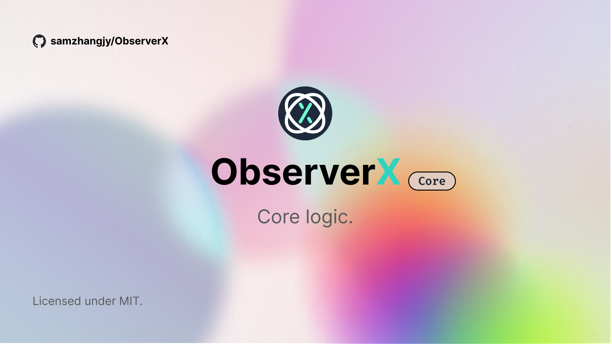

# `@observerx/core`

ObserverX bot core.

## Installation

```bash
$ npm install @observerx/core
```

## Usage

```js
import ObserverX from '@observerx/core';

const bot = new ObserverX();

const stream = await bot.chat('Hello, world!');
// stream is a generator
for await (const part of stream) {
  console.log(part);
}
```
