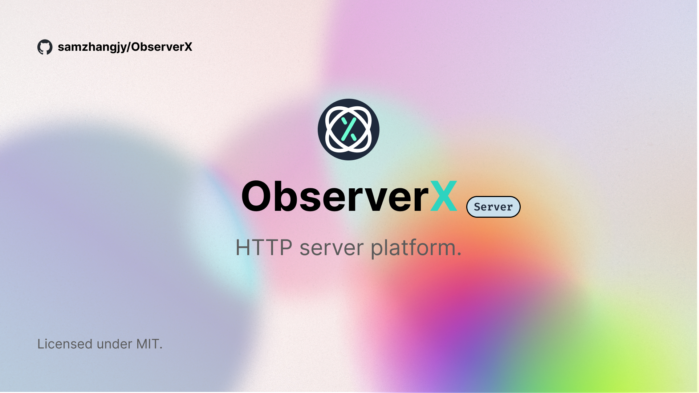

# `@observerx/server`

HTTP server for ObserverX, based on Expressjs.

## Installation

```bash
$ npm install @observerx/server
```

## Usage

```js
import PlatformHttpServer from '@observerx/server';

const dataSource = getDataSource();
const server = new PlatformHttpServer(dataSource);
server.start();
// Server is listening on localhost:3000

// You can also set a port number and a host name through environment variables
```

> Note: Configurations of ObserverX core should be written in environment variables or a `.env` file.
